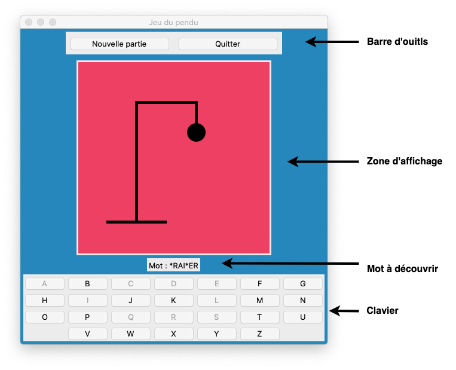
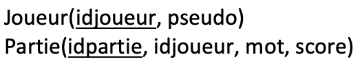

**Sommaire**

[[_TOC_]]

# BE #5 : Le jeu du Pendu

L'objectif de ce BE est de réaliser le `jeu du Pendu`. Pour rappel, ce jeu consiste à essayer de découvrir un mot qui est affiché de manière masquée (chacune de ses lettres est remplacée par le caractère _'*'_). Pour cela, le joueur sélectionne une lettre sur le clavier virtuel. Si elle fait partie du mot, alors le mot à découvrir est ré-affiché en laissant apparaître cette lettre en clair. Si par contre le mot ne contient pas la lettre sélectionnée, alors le compteur de coups ratés augmente d'un et l'élément suivant du pendu est ajouté au dessin. Le joueur gagne s'il a pu découvrir le mot avant que le pendu ne soit complètement affiché (au delà de 10 coups manqués). La figure ci-dessous présente l'interface que nous allons construire ; oui, les couleurs piquent un peu aux yeux, mais ça vous aidera à répondre à la première question !

<center></center>

Nous allons vous accompagner dans le développement de ce programme. La première partie (90 minutes) porte sur la mise en place de l'interface graphique. La seconde (75 minutes) porte sur la logique du jeu, à partir des commandes associées au bouton _Nouvelle Partie_ et aux Boutons-lettres. La troisième partie met en place le dessin du pendu (75 minutes). La dernière partie propose de développer des fonctionnalités supplémentaires à notre application durant l'autonomie (avec une question _Bonus_ pour les plus téméraires !).

Ce BE fera l'objet d'un compte-rendu (CR), seul ou en binôme. L'énoncé correspond à 4h de TD encadrées et 2h d'autonomie. Avant de commencer, veuillez prendre connaissance des consignes concernant le rendu du travail (à respecter scrupuleusement) qui se trouvent dans le fichier [consignes_BE#5.md](./consignes_BE#5.md), dans le même répertoire que cet énoncé.

---    
## Partie 1 - Mise en place de l'interface statique (90 min.)

__Exercice 1 -__ Dessinez l'arbre de scène correspondant à la capture d'écran ci-dessus.    

__Exercice 2 -__ En vous inspirant de l'organisation des classes du BE #4, programmez l'interface statique (_i.e._ sans programmer les commandes associées aux boutons) en distinguant la classe __FenPrincipale__ et la classe __ZoneAffichage__. À ce stade, à la place des 26 boutons du clavier (correspondant aux 26 lettres en majuscule), placez un simple bouton _"A"_  car le dessin du clavier est traité dans l'exercice suivant.

Testez votre interface et faites les ajustements nécessaires pour obtenir une apparence proche de celle donnée en exemple (mais sans le clavier, et avec les couleurs qui vous conviennent !). Le programme principal se réduira à ces quelques lignes :
```python
if __name__ == '__main__':
	fen = FenPrincipale()
	fen.mainloop()
```

_Remarque_ : Vous pouvez à ce stade ajouter la commande _self.destroy_ sur le bouton _Quitter_.


__Exercice 3 -__ Nous allons maintenant dessiner le clavier tel qu'il apparaîtra dans la version finale.

  1. __Liste des boutons__ Les 26 boutons seront créés et stockés dans une liste de boutons. Pour transformer les nombres de 0 à 25 en lettres  _A_, ..., _Z_, vous pourrez utiliser l'instruction suivante ```t = chr(ord('A')+i)``` qui transforme l'entier _i=0_ en une chaîne d'un seul caractère _t="A"_, l'entier _i=1_ en une chaîne d'un seul caractère _t="B"_, ...    
  1. __Placement des boutons__ La disposition des boutons en grille sera réalisée grâce à la commande _grid_, selon l'exemple suivant : ```unBouton.grid(row=1, column=2)``` positionne _unBouton_ sur la première ligne, seconde colonne de la grille (dont la taille s'adapte automatiquement).

Pensez à exécuter votre programme pour vérifier le placement du clavier virtuel.


---    
## Partie 2 - Logique de jeu, commandes (75 min.)

 Cette partie est destinée à implémenter la logique de jeu, à travers les commandes de l'interface :

  - _Bouton "Quitter"_ (vous l'avez peut être déjà fait, _cf_ remarque ci-dessus).
  - _Bouton "Nouvelle partie"_.
  - _Boutons-lettres "A", ..., "Z"_.

On fait ici abstraction de la représentation graphique du pendu qui sera traitée dans la partie suivante. Allons-y pas-à-pas...

### Bouton "Nouvelle Partie" (30 min.)

Une partie ne pourra commencer que si le joueur appuie sur le bouton "Nouvelle partie".

__Exercice 4 -__ L'appuie sur ce bouton doit provoquer une ré-initialisation de toute l'interface : 

  - Tirer un nouveau mot au hasard dans le fichier [mots.txt](./mots.txt) (à votre disposition à côté de cet énoncé) et réinitialiser le mot à découvrir;   
  - Dégriser les boutons-lettres (par la commande suivante ```unBouton.config(state=NORMAL)```);    
  - Effacer le dessin du pendu (question traitée dans la partie suivante de cet énoncé).

_Quelques conseils pour l'implémentation_

  - Au lancement de l'application, pensez à griser toutes les lettres du clavier (l'utilisateur comprend alors qu'il doit appuyer sur le bouton "Nouvelle partie"). 
  - Utilisez la méthode suivante pour charger les mots du fichier _mots.txt_ dans une liste privée appelée _self.\_\_mots_. Cette liste sera chargée une fois pour toute au lancement de l'application, et utilisée à chaque nouvelle partie.   
```python
def chargeMots(self):
	f = open('mots.txt', 'r')
	s = f.read()
	self.__mots = s.split('\n')
	f.close()
```   
  - Pour tirer un nouveau mot au hasard, utilisez la fonction _randint(...)_ (```from random import randint```).

Pensez à vérifier que votre application est bien fonctionnelle à ce stade.


### Boutons-lettres "A", ..., "Z" (45 min.)

Le fait d'appuyer sur une lettre du clavier virtuel doit provoquer un certain nombre d'actions :
 
   - griser le bouton-lettre qui vient d'être cliqué (```state=DISABLED```);    
   - faire apparaître autant de fois que nécessaire la lettre cliquée dans le mot à découvrir;  
   - vérifier si la partie est perdue, gagnée, ou si elle se poursuit;      
   - éventuellement, compléter le dessin du pendu si la lettre n'est pas présente dans le mot (action traitée dans la partie suivante de cet énoncé).

Chaque bouton doit pouvoir être identifié par la fonction de _callback_ appelée ici _cliquer_. Or il n'est pas possible de passer le numéro du bouton-lettre au _callback_ (aucun argument n'est permis). Nous allons procéder en créant notre propre classe de boutons, héritant de la classe __Button__.

__Exercice 5 -__ Suivez les étapes proposées

  1. Créer la classe __MonBoutonLettre__, qui hérite de la classe __Button__, et qui sauvegarde, en tant qu'attribut privé, la lettre correspondant au bouton (ou le numéro du bouton).  Modifier en conséquence le constructeur de la classe __FenPrincipale__ pour que le clavier virtuel soit composé de 26 instances de la classe __MonBoutonLettre__. 
  1. Créer la fonction de callback _cliquer(self)_ dans la classe __MonBoutonLettre__, qui fera notamment appel à une méthode _traitement(...)_ de la classe __FenPrincipale__.    
  1. Programmer cette méthode _traitement(...)_ dont l'objectif est de mettre à jour l'affichage du mot.    
    - Si la partie est gagnée, bloquez l'utilisation du clavier, et affichez un texte qui indique au joueur que c'est gagné !  
    - La partie est perdue quand le nombre de coups dépasse 10 (c'est le nombre d'éléments nécessaires pour dessiner entièrement le pendu). Bloquez alors l'utilisation du clavier, et affichez un texte qui indique au joueur que c'est perdu !  

À ce stade, l'application doit être entièrement fonctionnelle, seul le dessin du pendu est manquant, ce que nous allons compléter dès à présent...


---  
## Partie 3 - Le dessin du pendu (75 min.)

Cette partie est consacrée au dessin progressif du pendu, au fur et à mesure des échecs du joueur. Ce dessin s'appuie sur les connaissances acquises lors du BE #4 et les classes du fichier [formes.py](./formes.py), disponible à côté de cet énoncé pour ceux qui le souhaitent. L'idée est de créer le pendu comme une liste de rectangles et d'ellipses (10 pièces doivent suffire).

Le parti pris ici est de créer et de dessiner les 10 pièces du pendu dans le constructeur de la classe __ZoneAffichage__, mais en leur affectant la propriété `state="hidden"`, de telle sorte qu'elles ne soient pas visibles. Ce n'est qu'au fur et à mesure de l'avancement d'une partie que les pièces apparaissent sur le canevas, en passant du statut `"hidden"` au statut `"normal"`. La réinitialisation liée à une nouvelle partie consistera alors à cacher l'ensemble des pièces. 

*Remarque* : Notez qu'il aurait aussi été possible d'adopter un autre point de vue qui consisterait à créer et dessiner chaque pièce lors de chaque partie.

__Préliminaires sur le fichier [formes.py](./formes.py)__ 

  - Modifier le fichier [formes.py](./formes.py) de telle manière que les rectangles et les ellipses soient cachés lors de leur création.    
  - Il est nécessaire de prévoir une méthode _setState(s)_ qui permette de changer ce statut. La méthode étant identique pour les rectangles et pour les ellipses, il convient de la factoriser dans la classe __Forme__ :
```python
def setState(self, s):
    self.__canevas.itemconfig(self._item, state=s)
```

__Exercice 6 -__ Mettez en place la stratégie décrite ci-dessus pour terminer l'application.

Pour gagner un peu de temps, voici un exemple de jeu de pièces (avec leur position et leurs dimensions) qui permettent de dessiner le pendu de la première figure.

```python
# Base, Poteau, Traverse, Corde
Rectangle(self, 50,  270, 200,  26, "brown")
Rectangle(self, 87,   83,  26, 200, "brown")
Rectangle(self, 87,   70, 150,  26, "brown")
Rectangle(self, 183,  67,  10,  40, "brown")
# Tete, Tronc
Rectangle(self, 188, 120,  20,  20, "black")
Rectangle(self, 175, 143,  26,  60, "black")
# Bras gauche et droit
Rectangle(self, 133, 150,  40,  10, "black")
Rectangle(self, 203, 150,  40,  10, "black")
# Jambes gauche et droite
Rectangle(self, 175, 205,  10,  40, "black")
Rectangle(self, 191, 205,  10,  40, "black")
```
Rien ne vous empêche de customiser votre pendu !


---
## Partie 4 - Améliorations du jeu (autonomie)

Voici quelques améliorations pour le jeu, à rendre compte dans votre CR. Seule la dernière amélioration est considérée comme un bonus.

__Exercice 7 - Apparence__ Développez le code qui permet au joueur de choisir les couleurs principales de l'application (par un  menus, par des boutons...).

__Exercice 8 - Triche !__ Implémentez une technique "_Undo_" qui permet de revenir de un ou plusieurs coups en arrière, au cours d'une partie.

__Bonus - Score joueur__ Implémentez un système de sauvegarde des échecs et des succès d'un joueur (identifié par un pseudo demandé au joueur en début de partie). Techniquement, on pourra créer une base de données _SQL_ (_cf_ BE #3), appelée _pendu.db_, qui stockera une table avec les joueurs et une table avec les parties jouées par ces joueurs, selon le schéma suivant :

<center></center>

Le score pour chaque mot pourra être défini comme le taux de caractères trouvés (ainsi un score de 1.0 désigne un succès).

Dans un premier temps, pour vérifier que votre programme fonctionne, vous pouvez consulter la base _pendu.db_ à l'aide de ```DB Browser for SQLite```. Si vous le souhaitez, vous pouvez alors intégrer à votre application un affichage de l'historique des parties du joueur et/ou de ses performances.
